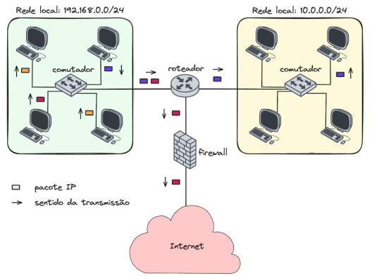

# Simulador de Redes - Projeto Prático 02

## Proposta
Este código é o segundo, e último, projeto da disciplina de Programação Orientada a Objetos
do curso de Engenharia de Telecomunicações.

Nos foi proposto criar um programa que simulasse o funcionamento de uma Rede TCP/IP. 
A rede obedece a topologia da figura abaixo:



Obedecendo a rede proposta, algumas funcionalidades teriam que ser implementadas.
Além das funcionalidades, deve-se também efetuar a simulação de um pacote IP sendo transportado
pela rede.

Antes de tudo, foi necessário realizar o Diagrama UML para esquematizar todos os métodos, classes e 
o que mais fossem ser usados na construção desta aplicação.

Na raiz do repositório, se encontram dois diagramas UML. O modelagem.png foi exportado diretamente
da aplicação StarUML. Já o modelagem2.png, foi obtido através de uma screenshot.


## Execução e funcionamento
Ao clonar o repositório, recomendo usar o comando abaixo para uma melhor experiência:
```Linux
./gradlew --console=plain -q run
```

O programa efetua as seguintes funcionalidades:
- Lista Dispositivos por tipo;
- Lista Dispositivos por rede;
- Lista as Rotas do roteador;
- Lista as Regras de filtragem do Firewall;
- Cria Regras de Filtragem para o Firewall;
- Apaga Regras de Filtragem;

Para exercer qualquer movimento, o usuário sempre terá a interação com um menu. Além disso, cada
funcionalidade que necessita de informações do usuário, é acompanhada por um menu explicativo, 
com informações e direções de como o usuário deve proceder.

## Limitação na Execução do Código
O programa não efetua, da maneira correta, a simulação de processamento de um Pacote IP.
Em algum momento, entre as redes, ele se perde ao chegar no outro comutador.
